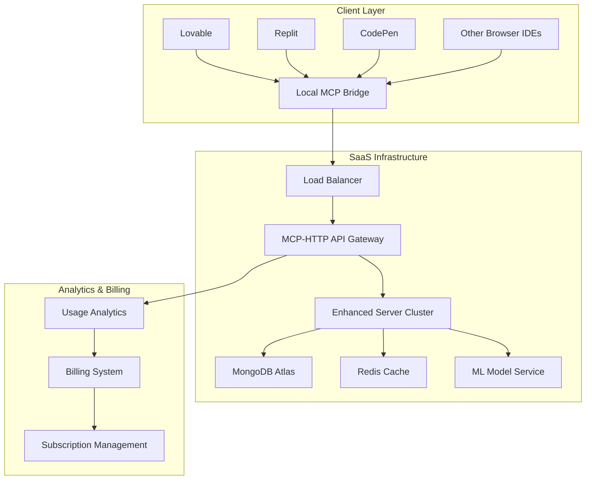

# 🚀 Future Cloud Architecture - Business Opportunity

**MCP-over-HTTP Cloud Service for Browser-Based AI Platforms**

---

## 🎯 **Executive Summary**

The cloud deployment architecture for Lovable and Replit represents a significant **monetization opportunity** by creating a **SaaS MCP Memory Service** that serves browser-based AI platforms through a hybrid MCP-over-HTTP architecture.

---

## 🏗️ **Technical Architecture**

### **Core Components:**



### **Implementation Requirements:**

#### **1. Server Infrastructure:**
- **Enhanced HTTP Server**: `servers/mcp_cloud_server.py`
- **MCP Bridge**: `bridge/universal_mcp_bridge.py` 
- **API Gateway**: Rate limiting, authentication, analytics
- **Load Balancer**: Multi-region deployment
- **Database**: MongoDB Atlas with sharding
- **Cache**: Redis for performance optimization
- **ML Service**: Dedicated HuggingFace inference endpoints

#### **2. Client Components:**
- **Universal Bridge**: Works with any MCP-compatible platform
- **Platform-Specific Installers**: Lovable, Replit, CodePen, etc.
- **Configuration Management**: API keys, endpoints, customization
- **Local Caching**: Reduce API calls, improve performance

#### **3. DevOps & Deployment:**
- **Container Orchestration**: Kubernetes/Docker Swarm
- **CI/CD Pipeline**: Automated testing and deployment
- **Monitoring**: Prometheus + Grafana
- **Logging**: ELK Stack for debugging and analytics
- **Security**: JWT authentication, API rate limiting

---

## 💰 **Business Model Analysis**

### **Revenue Streams:**

#### **1. Freemium Subscription Model** 🆓➕💰
```
Free Tier:
- 100 memory operations/month
- Basic embedding search
- Community support
- Single workspace

Pro Tier ($9.99/month):
- 10,000 operations/month  
- Advanced ML features
- Priority support
- Multiple workspaces
- Custom ML thresholds

Enterprise ($49.99/month):
- Unlimited operations
- Dedicated infrastructure
- Custom ML models
- SLA guarantees
- White-label options
```

#### **2. Usage-Based Pricing** 📊
```
Pay-Per-Use Model:
- $0.001 per memory save
- $0.0005 per search operation
- $0.002 per ML analysis
- Volume discounts available
- Enterprise bulk pricing
```

#### **3. Platform Integration Fees** 🤝
```
Revenue Sharing:
- Partner with Lovable/Replit
- 30% revenue share model
- Native integration in IDEs
- Co-marketing opportunities
```

### **Market Analysis:**

#### **Total Addressable Market (TAM):**
- **Browser-based IDEs**: Growing at 25% YoY
- **AI-assisted development**: $2.9B market by 2025
- **Developer tools SaaS**: $8.3B market
- **Memory/context services**: Emerging market (~$500M potential)

#### **Competitive Advantages:**
- ✅ **First-mover** in MCP-over-HTTP space
- ✅ **99.56% ML accuracy** proven model
- ✅ **Universal compatibility** with any MCP platform
- ✅ **Hybrid architecture** (local + cloud benefits)
- ✅ **Open-source foundation** with commercial extensions

---

## 🚀 **Implementation Roadmap**

### **Phase 1: MVP Development** (4-6 weeks)
- [ ] **MCP-HTTP Bridge Server**
  - Convert existing `main.py` to HTTP-compatible
  - Add authentication and rate limiting
  - Implement usage analytics
  
- [ ] **Universal MCP Client Bridge**
  - Local MCP server that proxies to HTTP API
  - Support for Lovable and Replit
  - Configuration management
  
- [ ] **Cloud Deployment**
  - Railway/Render deployment setup
  - MongoDB Atlas integration
  - Basic monitoring and logging

### **Phase 2: Platform Integration** (3-4 weeks)
- [ ] **Lovable Integration**
  - Custom MCP bridge for Lovable
  - Installation script and documentation
  - Beta testing with Lovable users
  
- [ ] **Replit Integration**
  - Replit-specific bridge implementation
  - Repl deployment templates
  - Community outreach and testing

### **Phase 3: SaaS Infrastructure** (6-8 weeks)
- [ ] **Authentication System**
  - User registration and management
  - API key generation and validation
  - JWT token implementation
  
- [ ] **Billing & Subscription**
  - Stripe integration for payments
  - Usage tracking and billing
  - Subscription management dashboard
  
- [ ] **Analytics Dashboard**
  - Real-time usage monitoring
  - Performance metrics
  - User behavior analytics

### **Phase 4: Scale & Optimize** (4-6 weeks)
- [ ] **Performance Optimization**
  - Redis caching layer
  - CDN for global distribution
  - Database query optimization
  
- [ ] **Enterprise Features**
  - White-label solutions
  - Custom ML model training
  - Dedicated infrastructure options
  
- [ ] **Platform Expansion**
  - CodePen integration
  - StackBlitz support
  - VS Code Web integration

---

## 💡 **Monetization Strategies**

### **1. Direct Sales:**
- **Target**: Individual developers and small teams
- **Channel**: Website, developer communities, social media
- **Strategy**: Free tier → paid conversion through usage limits

### **2. B2B Partnerships:**
- **Target**: Browser IDE platforms (Lovable, Replit, CodePen)
- **Channel**: Direct partnership negotiations
- **Strategy**: Revenue sharing, white-label solutions

### **3. Enterprise Sales:**
- **Target**: Large development teams, enterprises
- **Channel**: Direct sales, partner channels
- **Strategy**: Custom solutions, dedicated infrastructure

### **4. API Marketplace:**
- **Target**: Third-party developers, plugin creators
- **Channel**: API marketplaces (RapidAPI, etc.)
- **Strategy**: Usage-based pricing with partner revenue share

---

## 🎯 **Success Metrics**

### **Technical KPIs:**
- **API Response Time**: < 200ms average
- **Uptime**: 99.9% SLA
- **ML Accuracy**: Maintain 99.56% trigger accuracy
- **Cache Hit Rate**: > 80% for repeated queries

### **Business KPIs:**
- **Monthly Recurring Revenue (MRR)**: $10K target by month 6
- **Customer Acquisition Cost (CAC)**: < $25 per user
- **Lifetime Value (LTV)**: > $250 per user
- **Churn Rate**: < 5% monthly

### **Growth Metrics:**
- **API Calls/Month**: 1M+ by month 6
- **Active Users**: 1,000+ by month 6
- **Platform Integrations**: 5+ by month 12
- **Revenue Growth**: 20% month-over-month

---

## 🔒 **Risk Analysis & Mitigation**

### **Technical Risks:**
- **Scalability**: Implement auto-scaling and load balancing
- **Security**: Regular security audits and compliance certifications
- **Reliability**: Multi-region deployment and disaster recovery

### **Business Risks:**
- **Competition**: Fast execution and strong technical differentiation
- **Market Adoption**: Focus on developer experience and community building
- **Platform Dependencies**: Diversify across multiple IDE platforms

### **Financial Risks:**
- **Customer Acquisition**: Optimize conversion funnels and reduce CAC
- **Infrastructure Costs**: Implement efficient caching and usage optimization
- **Pricing Strategy**: Regular market analysis and pricing adjustments

---

## 🌟 **Next Steps Decision Matrix**

### **Low Investment / High Impact:**
1. **Technical Proof of Concept** (2 weeks)
   - Build basic MCP-HTTP bridge
   - Test with Lovable integration
   - Validate technical feasibility

### **Medium Investment / High Impact:**
2. **MVP Development** (6-8 weeks)
   - Full SaaS platform development
   - Authentication and billing
   - Initial customer acquisition

### **High Investment / Very High Impact:**  
3. **Full Market Launch** (12-16 weeks)
   - Multi-platform support
   - Enterprise features
   - Aggressive marketing and sales

---

## 📊 **Financial Projections**

### **Conservative Scenario (12 months):**
- **Users**: 500 paying customers
- **Average Revenue Per User (ARPU)**: $15/month
- **Monthly Revenue**: $7,500
- **Annual Revenue**: $90,000

### **Optimistic Scenario (12 months):**
- **Users**: 2,000 paying customers  
- **ARPU**: $25/month
- **Monthly Revenue**: $50,000
- **Annual Revenue**: $600,000

### **Aggressive Scenario (12 months):**
- **Users**: 5,000+ paying customers
- **ARPU**: $35/month (mix of pro/enterprise)
- **Monthly Revenue**: $175,000+
- **Annual Revenue**: $2,100,000+

---

## 🎉 **Conclusion**

The cloud architecture for browser-based AI platforms represents a **significant business opportunity** with:

- ✅ **Clear market need** for memory services in browser IDEs
- ✅ **Technical differentiation** through MCP-over-HTTP architecture  
- ✅ **Scalable business model** with multiple revenue streams
- ✅ **Strong foundation** built on proven open-source technology

**Recommendation**: Proceed with **Phase 1 MVP** to validate market demand and technical feasibility before full commercial investment.

---

*This analysis provides a comprehensive framework for monetizing the MCP Memory Service through cloud deployment while maintaining the open-source foundation for local installations.*

