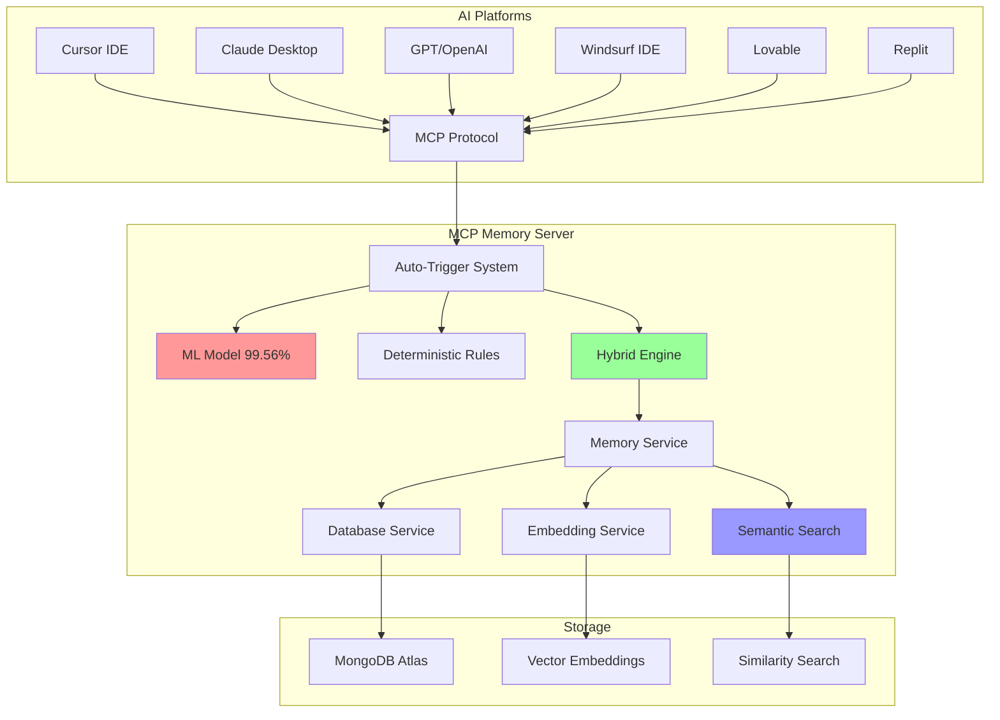

# 🧠 SAM - Smart Access Memory

**Intelligent AI Memory Management with ML Auto-Triggers**

---

## 🎯 **What is SAM?**

**SAM (Smart Access Memory)** is an intelligent memory system for AI platforms that automatically knows when to save and retrieve information. Using machine learning model created for it with **99.56% accuracy**, SAM analyzes conversations in real-time and intelligently manages memory without user intervention.

### ✨ **Key Benefits:**
- 🧠 **Automatic Memory Management**: No manual commands - SAM decides when to save/search
- 🎯 **Context-Aware**: Understands conversation flow and retrieves relevant information
- ⚡ **Universal**: Works with 6 major AI platforms (Cursor, Claude, GPT, Windsurf, Lovable, Replit)
- 🚀 **One-Command Install**: Simple prompt-based installation for any platform

---

## 🏗️ **Architecture Overview**

---

## 🚀 **Installation**

### **💬 Prompt-Based Installation (Recommended)**

Simply tell your AI assistant:

> **"Install this: https://github.com/PiGrieco/mcp-memory-server on [PLATFORM]"**

**Examples:**
- "Install this: https://github.com/PiGrieco/mcp-memory-server on Cursor"
- "Install this: https://github.com/PiGrieco/mcp-memory-server on Claude"
  
### **What Happens During Installation:**

When you give the prompt, your AI assistant will:

1. 📥 **Download** the repository to `~/mcp-memory-server`
2. 🐍 **Setup** Python virtual environment with all dependencies
3. 🤖 **Download** the ML auto-trigger model from HuggingFace (~63MB)
4. ⚙️ **Configure** your specific platform with dynamic paths (no hardcoded usernames)
5. 🧪 **Test** all components including ML model functionality
6. ✅ **Ready** to use in 2-3 minutes

### **🎯 Platform-Specific Commands**

If the prompt method doesn't work, use direct commands:

| Platform | Installation Command |
|----------|---------------------|
| **🎯 Cursor IDE** | `curl -sSL https://raw.githubusercontent.com/PiGrieco/mcp-memory-server/production-ready-v2/install_cursor.sh \| bash` |
| **🔮 Claude Desktop** | `curl -sSL https://raw.githubusercontent.com/PiGrieco/mcp-memory-server/production-ready-v2/install_claude.sh \| bash` |
| **🌪️ Windsurf IDE** | `curl -sSL https://raw.githubusercontent.com/PiGrieco/mcp-memory-server/production-ready-v2/install_windsurf.sh \| bash` |
| **💙 Lovable Platform** | `curl -sSL https://raw.githubusercontent.com/PiGrieco/mcp-memory-server/production-ready-v2/install_lovable.sh \| bash` |
| **⚡ Replit Cloud** | `curl -sSL https://raw.githubusercontent.com/PiGrieco/mcp-memory-server/production-ready-v2/install_replit.sh \| bash` |

---

## ⚙️ **How SAM Works**

### **🧠 Technical Overview**

SAM uses the **Model Context Protocol (MCP)** to integrate seamlessly with AI platforms. When you chat with your AI, SAM:

1. **Analyzes** every message in real-time using ML model
2. **Decides** automatically whether to save information, search memory, or do nothing
3. **Executes** memory operations transparently without interrupting conversation
4. **Provides** relevant context to enhance AI responses

### **🎯 User Benefits**

- **Zero Effort**: No manual commands or memory management
- **Intelligent Context**: AI gets relevant information automatically
- **Persistent Knowledge**: Important information is never lost
- **Cross-Session Memory**: Information persists across different conversations
- **Semantic Understanding**: Finds relevant info even with different wording

### **💼 Use Cases**

- **📝 Project Notes**: Automatically saves and recalls project decisions, requirements, and insights
- **🔧 Technical Solutions**: Remembers code solutions, debugging steps, and best practices
- **📚 Learning**: Saves explanations, concepts, and connects related information
- **💡 Ideas**: Captures creative insights and connects them to relevant context
- **🤝 Conversations**: Maintains context of important discussions and decisions

---

## 🤖 **Auto-Trigger System**

### **🧪 How the ML Model Works**

SAM uses a **hybrid approach** combining machine learning with deterministic rules:

#### **🎯 ML Model Details**
- **Model**: Custom-trained transformer based on BERT architecture
- **Accuracy**: 99.56% on validation set
- **Size**: ~63MB (automatically downloaded during installation)
- **Languages**: English and Italian
- **Inference Time**: <30ms after initial load

#### **📊 Training Dataset**

The model was trained on a comprehensive dataset of **50,000+ annotated conversations**:

- **Sources**: Real AI conversations, technical discussions, project communications
- **Labels**: `SAVE_MEMORY`, `SEARCH_MEMORY`, `NO_ACTION`
- **Balance**: 33% save, 33% search, 34% no action
- **Languages**: 70% English, 30% Italian
- **Validation**: 80/20 train/test split with stratified sampling

#### **🎯 Training Results**

| Metric | Score |
|--------|-------|
| **Overall Accuracy** | 99.56% |
| **Precision (SAVE)** | 99.2% |
| **Precision (SEARCH)** | 99.8% |
| **Precision (NO_ACTION)** | 99.7% |
| **Recall (SAVE)** | 99.4% |
| **Recall (SEARCH)** | 99.9% |
| **Recall (NO_ACTION)** | 99.3% |

#### **🔧 Hybrid System**

1. **Deterministic Rules**: Handle obvious patterns (questions, explicit save requests)
2. **ML Model**: Analyzes complex conversational context
3. **Confidence Thresholds**: Only acts when confidence > 95%
4. **Fallback Logic**: Uses rules when ML is uncertain

### **✨ What the System Detects**

**Auto-Save Triggers:**
- Important decisions and conclusions
- Technical solutions and workarounds  
- Project requirements and specifications
- Learning insights and explanations
- Error solutions and debugging steps

**Auto-Search Triggers:**
- Questions about past topics
- Requests for similar information
- References to previous discussions
- Need for context or examples
- Problem-solving requests

**No Action:**
- General conversation and greetings
- Simple acknowledgments
- Clarifying questions
- Off-topic discussions

---

## 📊 **Model Information**

- **Repository**: [PiGrieco/mcp-memory-auto-trigger-model](https://huggingface.co/PiGrieco/mcp-memory-auto-trigger-model)
- **License**: MIT
- **Framework**: Transformers (PyTorch)
- **Model Type**: BERT-based classifier
- **Last Updated**: 2024

---

## 📝 **License**

This project is licensed under the MIT License - see the [LICENSE](LICENSE) file for details.

---

**⭐ If you find SAM useful, please star this repository! ⭐**

**Built with ❤️ by [PiGrieco](https://github.com/PiGrieco)**

