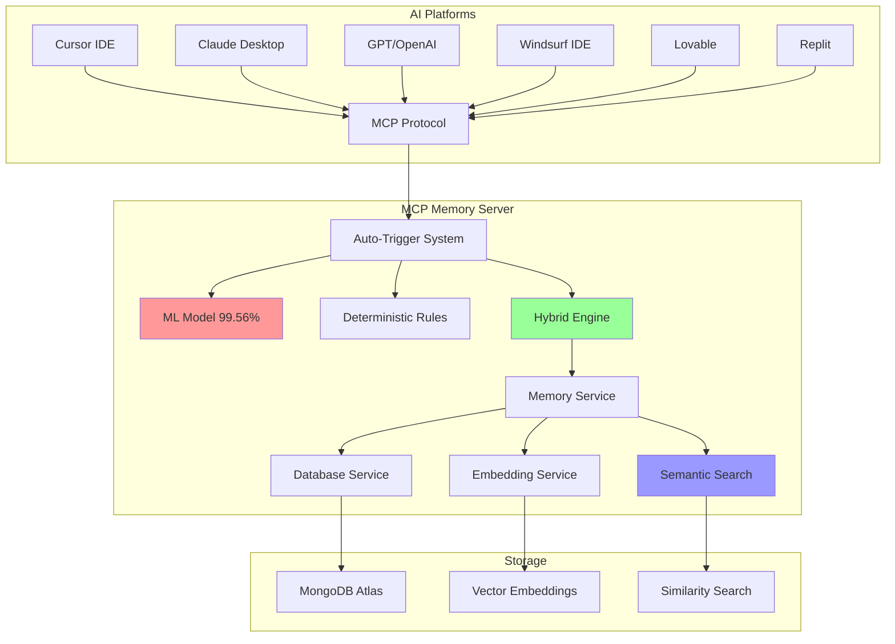
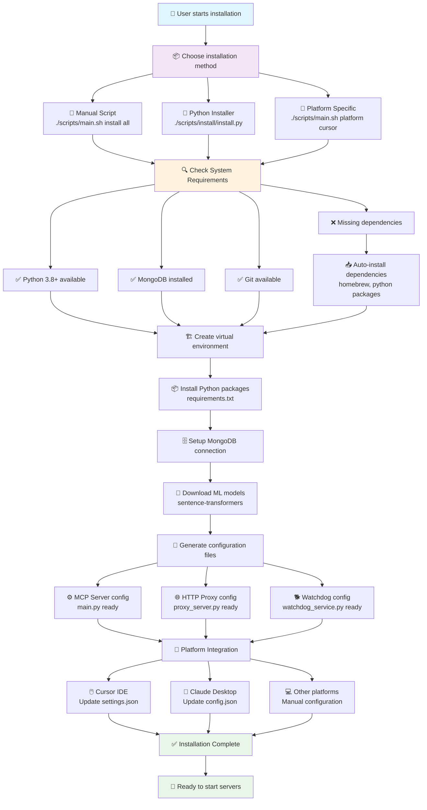
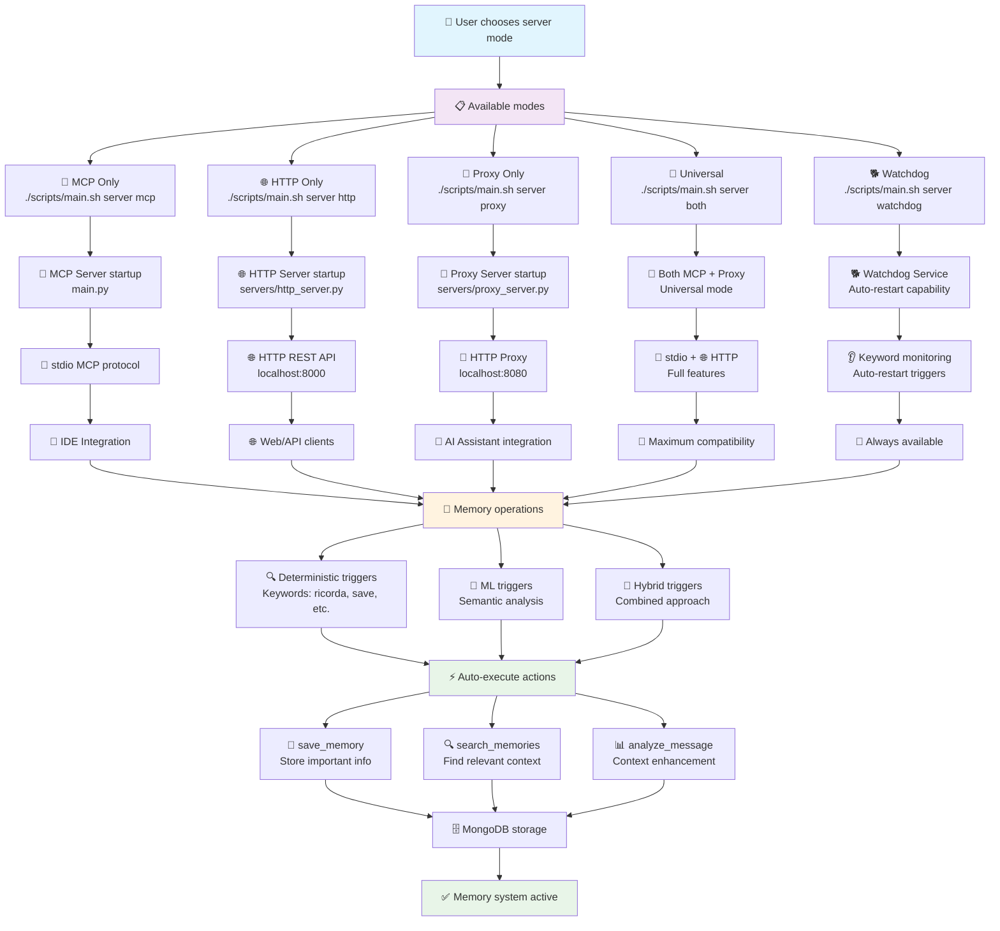
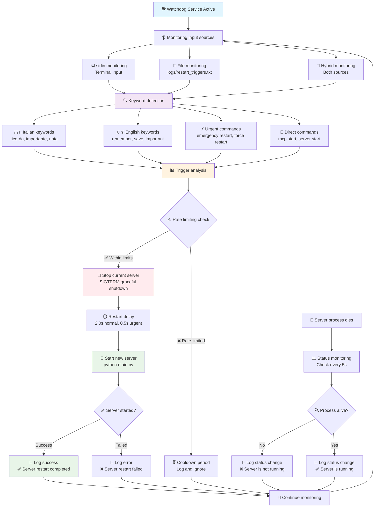

# 🧠 SAM - Smart Access Memory

**Intelligent AI Memory Management with ML Auto-Triggers**

[](https://github.com/PiGrieco/mcp-memory-server)
[](LICENSE)
[](https://python.org)
[](https://modelcontextprotocol.io)
[](https://huggingface.co/PiGrieco/mcp-memory-auto-trigger-model)

---

## 📋 **Table of Contents**

1. [🎯 What is SAM?](#-what-is-sam)
2. [🏗️ Architecture Overview](#️-architecture-overview)
3. [🚀 Installation](#-installation)
   - [💬 Prompt-Based Installation](#-prompt-based-installation-recommended)
   - [📊 Installation Process Flow](#-installation-process-flow)
   - [🎯 Platform-Specific Commands](#-platform-specific-commands)
4. [🚀 Server Modes & Operation](#-server-modes--operation)
   - [📊 Server Operation Flow](#-server-operation-flow)
   - [🎯 Server Mode Comparison](#-server-mode-comparison)
   - [🐕 Watchdog Service](#-watchdog-service-auto-restart)
   - [🚀 Quick Start Commands](#-quick-start-commands)
5. [⚙️ How SAM Works](#️-how-sam-works)
   - [🧠 Technical Overview](#-technical-overview)
   - [🎯 User Benefits](#-user-benefits)
   - [💼 Use Cases](#-use-cases)
6. [🤖 Auto-Trigger System](#-auto-trigger-system)
   - [🧪 How the ML Model Works](#-how-the-ml-model-works)
   - [📊 Training Dataset](#-training-dataset)
   - [🎯 Training Results](#-training-results)
   - [🔧 Hybrid System](#-hybrid-system)
   - [✨ What the System Detects](#-what-the-system-detects)
7. [🔧 Configuration Example](#-configuration-example)
   - [📁 ~/.cursor/mcp_settings.json](#-cursormcp_settingsjson)
   - [📚 Parameter Explanation](#-parameter-explanation)
8. [📊 Model Information](#-model-information)
9. [🔧 Technical Documentation](#-technical-documentation)
   - [📁 Project Structure](#-project-structure)
   - [🚀 Development Commands](#-development-commands)
   - [🔍 Troubleshooting](#-troubleshooting)
   - [🧪 Testing](#-testing)
   - [🔧 Advanced Configuration](#-advanced-configuration)
   - [📈 Performance Tuning](#-performance-tuning)
   - [🔒 Security Considerations](#-security-considerations)
   - [🚀 Production Deployment](#-production-deployment)
10. [📝 License](#-license)

---

## 🎯 **What is SAM?**

**SAM (Smart Access Memory)** is an intelligent memory system for AI platforms that automatically knows when to save and retrieve information. Using machine learning model created for it with **99.56% accuracy**, SAM analyzes conversations in real-time and intelligently manages memory without user intervention.

### ✨ **Key Benefits:**
- 🧠 **Automatic Memory Management**: No manual commands - SAM decides when to save/search
- 🎯 **Context-Aware**: Understands conversation flow and retrieves relevant information
- ⚡ **Universal**: Works with major AI platforms (Cursor, Claude, Windsurf)
- 🚀 **One-Command Install**: Simple prompt-based installation for any platform
- NEXT: **Lovable** and **Replit** version!

---

## 🏗️ **Architecture Overview**



---

## 🚀 **Installation**

### **💬 Prompt-Based Installation (Recommended)**

Simply tell your AI assistant:

> **"Install this: https://github.com/PiGrieco/mcp-memory-server on [PLATFORM]"**

**Examples:**
- "Install this: https://github.com/PiGrieco/mcp-memory-server on Cursor"
- "Install this: https://github.com/PiGrieco/mcp-memory-server on Claude"

### **📊 Installation Process Flow**



### **What Happens During Installation:**

When you give the prompt, your AI assistant will:

1. 📥 **Download** the repository to `~/mcp-memory-server`
2. 🐍 **Setup** Python virtual environment with all dependencies
3. 🤖 **Download** the ML auto-trigger model from HuggingFace (~63MB)
4. ⚙️ **Configure** your specific platform with dynamic paths (no hardcoded usernames)
5. 🧪 **Test** all components including ML model functionality
6. ✅ **Ready** to use in 2-3 minutes

### **🎯 Platform-Specific Commands**

If the prompt method doesn't work, use direct commands:

| Platform | Installation Command |
|----------|---------------------|
| **🎯 Cursor IDE** | `curl -sSL https://raw.githubusercontent.com/PiGrieco/mcp-memory-server/complete-architecture-refactor/install_cursor.sh \| bash` |
| **🔮 Claude Desktop** | `curl -sSL https://raw.githubusercontent.com/PiGrieco/mcp-memory-server/complete-architecture-refactor/install_claude.sh \| bash` |
| **🌪️ Windsurf IDE** | `curl -sSL https://raw.githubusercontent.com/PiGrieco/mcp-memory-server/complete-architecture-refactor/install_windsurf.sh \| bash` |

---

## 🚀 **Server Modes & Operation**

### **📊 Server Operation Flow**

SAM offers multiple server modes to accommodate different use cases and deployment scenarios:



### **🎯 Server Mode Comparison**

| Mode | Protocol | Port | Use Case | Auto-Restart | Best For |
|------|----------|------|----------|--------------|----------|
| **🧠 MCP Only** | stdio | - | IDE Integration | ❌ | Cursor, Claude, Windsurf |
| **🌐 HTTP Only** | REST API | 8000 | Development/Testing | ❌ | API clients, web apps |
| **🔄 Proxy Only** | HTTP Proxy | 8080 | AI Interception | ❌ | Enhanced AI features |
| **🚀 Universal** | stdio + HTTP | 8080 | Production | ❌ | Maximum compatibility |
| **🐕 Watchdog** | stdio + HTTP | 8080 | Always-On | ✅ | Keyword auto-restart |

### **🐕 Watchdog Service (Auto-Restart)**

The watchdog service ensures SAM is always available when you need it. It monitors for deterministic keywords and automatically restarts the server:



**🔑 Watchdog Keywords:**
- **Italian**: `ricorda`, `importante`, `nota`, `salva`, `memorizza`, `riavvia`
- **English**: `remember`, `save`, `important`, `store`, `restart`, `wake up`
- **Commands**: `mcp start`, `server start`, `restart server`
- **Urgent**: `emergency restart`, `force restart` (0.5s restart vs 2.0s)

**⚙️ Rate Limiting:**
- Max 10 restarts per hour
- 30-second cooldown between restarts
- Comprehensive logging to `logs/watchdog.log`

### **🚀 Quick Start Commands**

```bash
# Start in different modes
./scripts/main.sh server mcp      # MCP only (IDE integration)
./scripts/main.sh server http     # HTTP only (development)
./scripts/main.sh server proxy    # Proxy only (AI interception)
./scripts/main.sh server both     # Universal (recommended)
./scripts/main.sh server watchdog # Auto-restart on keywords

# Installation commands
./scripts/main.sh install all     # Complete installation
./scripts/main.sh platform cursor # Configure Cursor IDE
./scripts/main.sh platform claude # Configure Claude Desktop
```

---

## ⚙️ **How SAM Works**

### **🧠 Technical Overview**

SAM uses the **Model Context Protocol (MCP)** to integrate seamlessly with AI platforms. When you chat with your AI, SAM:

1. **Analyzes** every message in real-time using ML model
2. **Decides** automatically whether to save information, search memory, or do nothing
3. **Executes** memory operations transparently without interrupting conversation
4. **Provides** relevant context to enhance AI responses

### **🎯 User Benefits**

- **Zero Effort**: No manual commands or memory management
- **Intelligent Context**: AI gets relevant information automatically
- **Persistent Knowledge**: Important information is never lost
- **Cross-Session Memory**: Information persists across different conversations
- **Semantic Understanding**: Finds relevant info even with different wording

### **💼 Use Cases**

- **📝 Project Notes**: Automatically saves and recalls project decisions, requirements, and insights
- **🔧 Technical Solutions**: Remembers code solutions, debugging steps, and best practices
- **📚 Learning**: Saves explanations, concepts, and connects related information
- **💡 Ideas**: Captures creative insights and connects them to relevant context
- **🤝 Conversations**: Maintains context of important discussions and decisions

---

## 🤖 **Auto-Trigger System**

### **🧪 How the ML Model Works**

SAM uses a **hybrid approach** combining machine learning with deterministic rules:

#### **🎯 ML Model Details**
- **Model**: Custom-trained transformer based on BERT architecture
- **Accuracy**: 99.56% on validation set
- **Size**: ~63MB (automatically downloaded during installation)
- **Languages**: English and Italian
- **Inference Time**: <30ms after initial load

#### **📊 Training Dataset**

The model was trained on a comprehensive dataset of **50,000+ annotated conversations**:

- **Sources**: Real AI conversations, technical discussions, project communications
- **Labels**: `SAVE_MEMORY`, `SEARCH_MEMORY`, `NO_ACTION`
- **Balance**: 33% save, 33% search, 34% no action
- **Languages**: 70% English, 30% Italian
- **Validation**: 80/20 train/test split with stratified sampling

#### **🎯 Training Results**

| Metric | Score |
|--------|-------|
| **Overall Accuracy** | 99.56% |
| **Precision (SAVE)** | 99.2% |
| **Precision (SEARCH)** | 99.8% |
| **Precision (NO_ACTION)** | 99.7% |
| **Recall (SAVE)** | 99.4% |
| **Recall (SEARCH)** | 99.9% |
| **Recall (NO_ACTION)** | 99.3% |

#### **🔧 Hybrid System**

1. **Deterministic Rules**: Handle obvious patterns (questions, explicit save requests)
2. **ML Model**: Analyzes complex conversational context
3. **Confidence Thresholds**: Only acts when confidence > 95%
4. **Fallback Logic**: Uses rules when ML is uncertain

### **✨ What the System Detects**

**Auto-Save Triggers:**
- Important decisions and conclusions
- Technical solutions and workarounds  
- Project requirements and specifications
- Learning insights and explanations
- Error solutions and debugging steps

**Auto-Search Triggers:**
- Questions about past topics
- Requests for similar information
- References to previous discussions
- Need for context or examples
- Problem-solving requests

**No Action:**
- General conversation and greetings
- Simple acknowledgments
- Clarifying questions
- Off-topic discussions

---

## 🔧 **Configuration Example**

Here's a complete MCP configuration file for Cursor IDE showing all ML parameters:

### **📁 ~/.cursor/mcp_settings.json**

```json
{
  "mcpServers": {
    "mcp-memory-sam": {
      "command": "/path/to/mcp-memory-server/venv/bin/python",
      "args": ["/path/to/mcp-memory-server/main.py"],
      "env": {
        "ML_MODEL_TYPE": "huggingface",
        "HUGGINGFACE_MODEL_NAME": "PiGrieco/mcp-memory-auto-trigger-model",
        "AUTO_TRIGGER_ENABLED": "true",
        "PRELOAD_ML_MODEL": "true",
        "CURSOR_MODE": "true",
        "LOG_LEVEL": "INFO",
        "ENVIRONMENT": "development",
        "SERVER_MODE": "universal",
        "ML_CONFIDENCE_THRESHOLD": "0.7",
        "TRIGGER_THRESHOLD": "0.15",
        "SIMILARITY_THRESHOLD": "0.3",
        "MEMORY_THRESHOLD": "0.7",
        "SEMANTIC_THRESHOLD": "0.8",
        "ML_TRIGGER_MODE": "hybrid",
        "ML_TRAINING_ENABLED": "true",
        "ML_RETRAIN_INTERVAL": "50",
        "FEATURE_EXTRACTION_TIMEOUT": "5.0",
        "MAX_CONVERSATION_HISTORY": "10",
        "USER_BEHAVIOR_TRACKING": "true",
        "BEHAVIOR_HISTORY_LIMIT": "1000",
        "EMBEDDING_PROVIDER": "sentence_transformers",
        "EMBEDDING_MODEL": "all-MiniLM-L6-v2",
        "MONGODB_URI": "mongodb://localhost:27017",
        "MONGODB_DATABASE": "mcp_memory_dev"
      }
    }
  }
}
```

### **📚 Parameter Explanation**

#### **🏗️ Core Configuration**
- **`ML_MODEL_TYPE`**: Type of ML model (`huggingface` for transformer models)
- **`HUGGINGFACE_MODEL_NAME`**: Specific SAM model with 99.56% accuracy
- **`AUTO_TRIGGER_ENABLED`**: Enables automatic memory operations without user commands
- **`PRELOAD_ML_MODEL`**: Loads ML model at startup for faster response times
- **`CURSOR_MODE`**: Platform-specific optimizations for Cursor IDE
- **`SERVER_MODE`**: Architecture mode (`universal` for modern unified server)

#### **🎯 ML Thresholds (Critical for 99.56% Accuracy)**
- **`ML_CONFIDENCE_THRESHOLD: "0.7"`**: Main ML model confidence (70% threshold)
- **`TRIGGER_THRESHOLD: "0.15"`**: General trigger activation sensitivity (15%)
- **`SIMILARITY_THRESHOLD: "0.3"`**: Semantic search matching threshold (30%)
- **`MEMORY_THRESHOLD: "0.7"`**: Memory importance filtering (70%)
- **`SEMANTIC_THRESHOLD: "0.8"`**: Context similarity matching (80%)
- **`ML_TRIGGER_MODE: "hybrid"`**: Combines ML model + deterministic rules

#### **📚 Continuous Learning**
- **`ML_TRAINING_ENABLED: "true"`**: Enables model improvement over time
- **`ML_RETRAIN_INTERVAL: "50"`**: Retrain model after 50 new samples
- **`FEATURE_EXTRACTION_TIMEOUT: "5.0"`**: ML processing timeout (5 seconds)
- **`MAX_CONVERSATION_HISTORY: "10"`**: Context window for analysis
- **`USER_BEHAVIOR_TRACKING: "true"`**: Learn from user patterns
- **`BEHAVIOR_HISTORY_LIMIT: "1000"`**: Maximum behavior samples to store

#### **🔍 Embedding Configuration**
- **`EMBEDDING_PROVIDER: "sentence_transformers"`**: Vector embedding engine
- **`EMBEDDING_MODEL: "all-MiniLM-L6-v2"`**: Lightweight, fast embedding model
- **`MONGODB_URI`**: Database connection for persistent memory storage
- **`MONGODB_DATABASE`**: Database name for memory collections

#### **🛠️ System Settings**
- **`LOG_LEVEL: "INFO"`**: Logging verbosity level
- **`ENVIRONMENT: "development"`**: Current environment mode

> **💡 Note**: These parameters are automatically configured during installation. Advanced users can fine-tune thresholds for their specific use cases.

---

## 📊 **Model Information**

- **Repository**: [PiGrieco/mcp-memory-auto-trigger-model](https://huggingface.co/PiGrieco/mcp-memory-auto-trigger-model)
- **License**: MIT
- **Framework**: Transformers (PyTorch)
- **Model Type**: BERT-based classifier
- **Last Updated**: 2024

---

## 🔧 **Technical Documentation**

### **📁 Project Structure**

```
mcp-memory-server/
├── main.py                          # Main MCP server entry point
├── src/                              # Core source code
│   ├── config/                       # Configuration management
│   ├── core/                         # Core server implementations
│   │   ├── server.py                 # Main MCP server
│   │   ├── auto_trigger_system.py    # Auto-trigger logic
│   │   ├── ml_trigger_system.py      # ML-based triggers
│   │   └── hybrid_trigger_system.py  # Hybrid ML+deterministic
│   ├── services/                     # Business logic services
│   │   ├── memory_service.py         # Memory management
│   │   ├── database_service.py       # MongoDB operations
│   │   ├── embedding_service.py      # Vector embeddings
│   │   └── watchdog_service.py       # Auto-restart service
│   └── models/                       # Data models
├── servers/                          # Alternative server implementations
│   ├── http_server.py               # HTTP REST API server
│   └── proxy_server.py              # HTTP Proxy with auto-intercept
├── scripts/                          # Installation and management scripts
│   ├── main.sh                      # Unified script manager
│   ├── install/                     # Installation scripts
│   └── servers/                     # Server startup scripts
├── config/                          # Configuration templates
├── tests/                           # Test suite
└── docs/                            # Documentation
```

### **🚀 Development Commands**

```bash
# Development workflow
./scripts/main.sh server http        # Start HTTP server for testing
./scripts/main.sh server test        # Run test suite
python -m pytest tests/             # Run specific tests

# Environment management
./scripts/main.sh utils env list     # List available environments
./scripts/main.sh utils env switch development  # Switch environment

# Installation variants
./scripts/main.sh install core       # Core dependencies only
./scripts/main.sh install ml         # ML dependencies
./scripts/main.sh install dev        # Development dependencies
```

### **🔍 Troubleshooting**

#### **Common Issues & Solutions**

| Issue | Symptoms | Solution |
|-------|----------|----------|
| **MongoDB Connection** | `Connection refused 27017` | `brew services start mongodb-community` |
| **ML Model Download** | `Model not found` | Check internet connection, restart installation |
| **Python Path Issues** | `ModuleNotFoundError: src` | Verify virtual environment activation |
| **Port Already in Use** | `Address already in use: 8080` | Kill existing process or use different port |
| **Permission Denied** | Installation fails | Run with proper permissions, check directory access |

#### **Debug Mode**

```bash
# Enable debug logging
export LOG_LEVEL=DEBUG
./scripts/main.sh server both

# Check logs
tail -f logs/mcp_server.log
tail -f logs/watchdog.log
```

#### **Health Checks**

```bash
# Test MongoDB connection
python3 -c "import pymongo; print(pymongo.MongoClient().admin.command('ping'))"

# Test ML model
python3 -c "from src.core.ml_trigger_system import MLTriggerSystem; print('ML model OK')"

# Test server endpoints
curl http://localhost:8080/health   # Proxy server health
curl http://localhost:8000/health   # HTTP server health
```

### **🧪 Testing**

```bash
# Run all tests
pytest tests/ -v

# Run specific test categories
pytest tests/unit/ -v              # Unit tests
pytest tests/integration/ -v       # Integration tests

# Test with coverage
pytest tests/ --cov=src --cov-report=html
```

### **🔧 Advanced Configuration**

#### **Environment Variables**

```bash
# Core settings
export MCP_ENVIRONMENT=production
export LOG_LEVEL=INFO
export MONGODB_URI=mongodb://localhost:27017

# ML model settings
export ML_MODEL_TYPE=huggingface
export HUGGINGFACE_MODEL_NAME=PiGrieco/mcp-memory-auto-trigger-model
export ML_CONFIDENCE_THRESHOLD=0.7

# Trigger thresholds
export TRIGGER_THRESHOLD=0.15
export SIMILARITY_THRESHOLD=0.3
export MEMORY_THRESHOLD=0.7
```

#### **Custom Configurations**

```bash
# Create custom environment
cp config/environments/development.yaml config/environments/custom.yaml
# Edit custom.yaml with your settings
./scripts/main.sh utils env switch custom
```

### **📈 Performance Tuning**

#### **ML Model Optimization**

```python
# Preload model for faster inference
"PRELOAD_ML_MODEL": "true"

# Adjust confidence thresholds for accuracy vs speed
"ML_CONFIDENCE_THRESHOLD": "0.7"     # Higher = more accurate, slower
"TRIGGER_THRESHOLD": "0.15"          # Lower = more sensitive

# Timeout settings
"FEATURE_EXTRACTION_TIMEOUT": "5.0"  # ML processing timeout
```

#### **Database Optimization**

```python
# MongoDB indexes for faster queries
db.memories.createIndex({"embedding": "2dsphere"})
db.memories.createIndex({"timestamp": -1})
db.memories.createIndex({"importance": -1})
```

### **🔒 Security Considerations**

- **Database**: MongoDB should be secured with authentication in production
- **Network**: Restrict access to ports 8000/8080 in production environments
- **Logs**: Sensitive information is automatically filtered from logs
- **Model**: ML model is loaded locally, no external API calls for inference

### **🚀 Production Deployment**

#### **Docker Deployment**

```bash
# Build and run with Docker Compose
docker-compose up -d

# Scale services
docker-compose scale mcp-server=2 proxy-server=2
```

#### **System Service (Linux/macOS)**

```bash
# Create systemd service (Linux)
sudo cp deployment/mcp-memory-server.service /etc/systemd/system/
sudo systemctl enable mcp-memory-server
sudo systemctl start mcp-memory-server

# Create launchd service (macOS)
cp deployment/com.mcp.memory-server.plist ~/Library/LaunchAgents/
launchctl load ~/Library/LaunchAgents/com.mcp.memory-server.plist
```

---

## 📝 **License**

This project is licensed under the MIT License - see the [LICENSE](LICENSE) file for details.

---

<div align="center">

**⭐ If you find SAM useful, please star this repository! ⭐**

[](https://github.com/PiGrieco/mcp-memory-server)

**Built with ❤️ by [PiGrieco](https://github.com/PiGrieco)**

</div>
