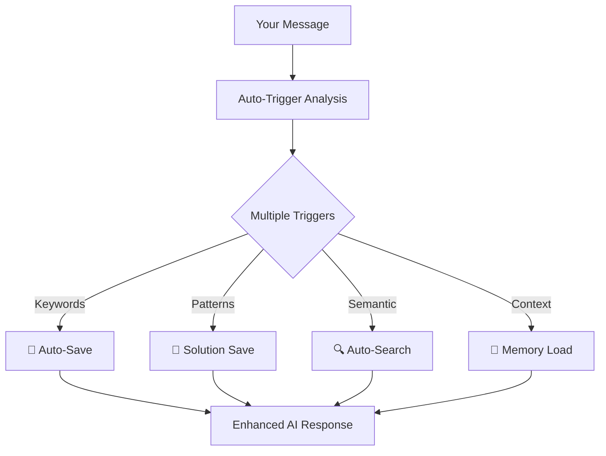

# 🧠 MCP Memory Server v2.0 - Auto-Trigger Edition

<div align="center">


*Transform any AI into a super-intelligent assistant with **automatic** persistent memory*

[🚀 One-Click Install](#-one-click-installation) • [✨ Auto-Trigger Demo](#-auto-trigger-demo) • [🎯 How It Works](#-how-it-works) • [📱 Supported AIs](#-supported-ai-platforms)

</div>

---

## 🌟 What's New in v2.0

### 🎯 **Revolutionary Auto-Trigger System**
No more manual "remember this" - your AI now **automatically**:
- 💾 **Saves important information** when you say "ricorda", "importante", etc.
- 🔍 **Finds relevant memories** when you ask similar questions
- 🧠 **Learns patterns** from your solutions and bug fixes
- ⚡ **Works in background** - completely transparent

### 📈 **Before vs After**

| **Before** | **After** |
|------------|-----------|
| 😴 AI forgets everything | 🧠 AI remembers forever |
| 🔄 Repeat context every time | ⚡ Context automatically loaded |
| 📝 Manual "remember this" | 🤖 Automatic memory capture |
| 💭 No learning between sessions | 📈 Continuous learning |

---

## 🚀 One-Click Installation

### **Copy-Paste This Command:**

```bash
curl -sSL https://raw.githubusercontent.com/PiGrieco/mcp-memory-server/main/install.sh | bash
```

**Or download and run locally:**

```bash
# Clone repository
git clone https://github.com/PiGrieco/mcp-memory-server.git
cd mcp-memory-server

# One-click install
python install.py
```

### **That's It! 🎉**
- ✅ All dependencies installed automatically
- ✅ Cursor IDE configured automatically  
- ✅ Claude Desktop configured automatically
- ✅ Auto-trigger system ready to use

---

## ✨ Auto-Trigger Demo

### **Try These in Your AI:**

**Test 1 - Keyword Trigger:**
```
"Ricorda che per fixare i CORS devi aggiungere Access-Control-Allow-Origin"
```
→ 💾 **Automatically saved as memory!**

**Test 2 - Pattern Recognition:**
```
"Ho risolto il bug di timeout aumentando connection_timeout a 30 secondi"
```
→ 💾 **Automatically saved as solution!**

**Test 3 - Smart Context:**
```
"Come posso gestire i timeout nel database?"
```
→ 🔍 **Automatically searches previous timeout solutions!**

### **Live Example:**
```
👤 You: "Ricorda che useCallback ottimizza i re-renders in React"
🤖 AI: "Perfect! I'll remember this optimization technique..."
💾 Background: Memory automatically saved!

👤 You: "Come posso ottimizzare le performance in React?"  
🤖 AI: "Based on what we discussed about useCallback..."
🧠 Background: Previous memory automatically loaded!
```

---

## 🎯 How It Works

### **7 Intelligent Auto-Triggers:**

<div align="center">

| Trigger Type | When It Activates | Example |
|--------------|------------------|---------|
| 🔤 **Keywords** | "ricorda", "importante", "nota" | "Ricorda questa fix" → Auto-save |
| 🔍 **Patterns** | "risolto", "bug fix", "solution" | "Ho risolto il problema" → Auto-save |
| 🎯 **Semantic** | Similar content detected | "Timeout error" → Auto-search previous |
| ⭐ **Importance** | High-value content identified | Critical info → Auto-save |
| 📏 **Length** | Long conversations | 5+ messages → Auto-summary |
| 🔄 **Context** | Topic changes detected | "New project" → Load relevant memories |
| ⏰ **Time** | Periodic checks | Every 10 min → Proactive suggestions |

</div>

### **Architecture:**


---

## 📱 Supported AI Platforms

### **🎯 Cursor IDE (Recommended)**
```bash
# Auto-configured by installer
# Just start typing in Cursor!
python main_simple.py  # Start server
```

### **💬 Claude Desktop**
```bash
# Auto-configured by installer  
# Restart Claude Desktop after install
```

### **🌐 Browser Extension**
- **ChatGPT** (chat.openai.com)
- **Claude** (claude.ai)
- **Perplexity** (perplexity.ai)
- **Poe** (poe.com)

### **🔌 API Integration**
```python
# Direct integration for any AI
from mcp_memory_server import AutoTriggerMemory

memory = AutoTriggerMemory()
result = await memory.process("Ricorda questa importante informazione")
# Automatically triggers save_memory
```

---

## 🎮 Quick Start Guide

### **Step 1: Install (30 seconds)**
```bash
python install.py
```

### **Step 2: Start Server (5 seconds)**
```bash
python main_simple.py
```

### **Step 3: Test in Your AI (1 minute)**
Open Cursor/Claude and try:
- "Ricorda che Python è case-sensitive"
- "Ho risolto l'errore usando try-catch"
- "Come posso gestire gli errori in Python?"

### **Step 4: Enjoy Your Super-AI! 🚀**
Your AI now has:
- 🧠 **Infinite memory** across all conversations
- ⚡ **Automatic learning** from every interaction
- 🎯 **Smart context** for better responses
- 🔍 **Instant access** to past solutions

---

## 🔧 Advanced Configuration

### **Customize Triggers:**
```bash
# Edit auto-trigger keywords
export TRIGGER_KEYWORDS="ricorda,nota,importante,save,remember"

# Edit solution patterns  
export SOLUTION_PATTERNS="risolto,solved,fixed,bug fix,solution"

# Adjust sensitivity
export AUTO_SAVE_THRESHOLD="0.7"
```

### **Monitor Activity:**
```bash
# Watch auto-triggers in real-time
tail -f logs/auto_trigger.log

# View memory statistics
curl http://localhost:8000/stats
```

### **Platform-Specific Settings:**
```json
// ~/.cursor/mcp_settings.json (auto-generated)
{
  "mcpServers": {
    "mcp-memory-auto": {
      "env": {
        "AUTO_TRIGGER": "true",
        "KEYWORDS": "ricorda,nota,importante",
        "PATTERNS": "risolto,solved,fixed"
      }
    }
  }
}
```

---

## 🆚 Comparison: Simple vs Full

| Feature | Simple Server | Full Server |
|---------|---------------|-------------|
| **Auto-Trigger** | ✅ All 7 types | ✅ All 7 types |
| **Installation** | ⚡ One command | 🔧 Complex setup |
| **Dependencies** | 📦 Minimal | 🐘 MongoDB, Cloud |
| **Memory Storage** | 💾 In-memory | 🌍 Persistent DB |
| **Best For** | 🚀 Quick start, testing | 🏢 Production, teams |

**Recommendation:** Start with Simple Server, upgrade to Full when needed.

---

## 📊 What Gets Automatically Saved

### **📝 Knowledge Capture:**
- "Ricorda che Redux usa immutable state"
- "Importante: sempre validare input utente"
- "Nota bene: questo pattern funziona bene"

### **🔧 Solution Tracking:**
- "Ho risolto il CORS error aggiungendo headers"
- "Bug fix: aumentare timeout per connessioni lente"
- "Fixed authentication usando JWT tokens"

### **📚 Learning Sessions:**
- Tutorial explanations
- Code examples and patterns  
- Best practices and warnings
- Configuration settings

---

## 🎯 Use Cases

### **👨‍💻 For Developers:**
- **Bug Solutions:** Never lose a working fix again
- **Code Patterns:** Remember effective implementations
- **Configuration:** Recall complex setup procedures
- **Learning:** Build permanent knowledge base

### **📝 For Content Creators:**
- **Ideas:** Capture creative insights automatically
- **Research:** Remember important findings
- **Templates:** Save effective formats
- **References:** Quick access to sources

### **🎓 For Students:**
- **Study Notes:** Automatic concept capture
- **Problem Solutions:** Never re-solve same problems
- **Research:** Permanent reference library
- **Learning Paths:** Track progress automatically

---

## 🧪 Testing & Validation

### **Automated Tests:**
```bash
# Test auto-trigger system
python test_auto_trigger.py

# Test integrations
python test_integrations.py

# Full system test
python test_complete_system.py
```

### **Manual Validation:**
1. **Keywords Work:** Say "ricorda" → see auto-save
2. **Patterns Work:** Say "risolto" → see auto-save  
3. **Search Works:** Ask similar question → see context
4. **Integration Works:** All platforms respond with memory

---

## 🆘 Troubleshooting

### **Common Issues:**

**Q: Auto-trigger not working?**
```bash
# Check server status
ps aux | grep main_simple.py

# Restart server
pkill -f main_simple.py && python main_simple.py
```

**Q: Cursor not connecting?**
```bash
# Verify config
cat ~/.cursor/mcp_settings.json

# Recreate config
python install.py
```

**Q: No memories saved?**
```bash
# Test manually
python -c "
from main_simple import SimpleMCPServer
server = SimpleMCPServer()
print('Keywords:', server.auto_trigger.keywords)
"
```

### **Get Help:**
- 📚 [Full Documentation](docs/)
- 🐛 [Report Issues](https://github.com/PiGrieco/mcp-memory-server/issues)
- 💬 [Community Discussions](https://github.com/PiGrieco/mcp-memory-server/discussions)

---

## 🔮 Roadmap

### **🚀 Coming Soon:**
- 🎨 **Visual Dashboard** - Web interface for memory management
- 🔗 **Team Sharing** - Collaborative memory spaces
- 🌍 **Cloud Sync** - Access memories anywhere
- 🤖 **More AI Platforms** - Expanding integration support
- 📱 **Mobile App** - Memory access on the go

### **💡 Contribute:**
We welcome contributions! The auto-trigger system is modular and extensible.

```bash
# Development setup
git clone https://github.com/PiGrieco/mcp-memory-server.git
cd mcp-memory-server
pip install -r requirements-dev.txt

# Add new trigger type
# Edit: src/core/auto_trigger_system.py
# Test: python test_new_trigger.py
```

---

## 📄 License & Credits

**MIT License** - Free for personal and commercial use

### **Built With:**
- 🔧 **MCP Protocol** - Model Context Protocol
- 🧠 **Sentence Transformers** - Semantic similarity  
- ⚡ **FastAPI** - High-performance API framework
- 🐍 **Python 3.8+** - Modern Python features

---

**Made with ❤️ for the AI community**

</div>
