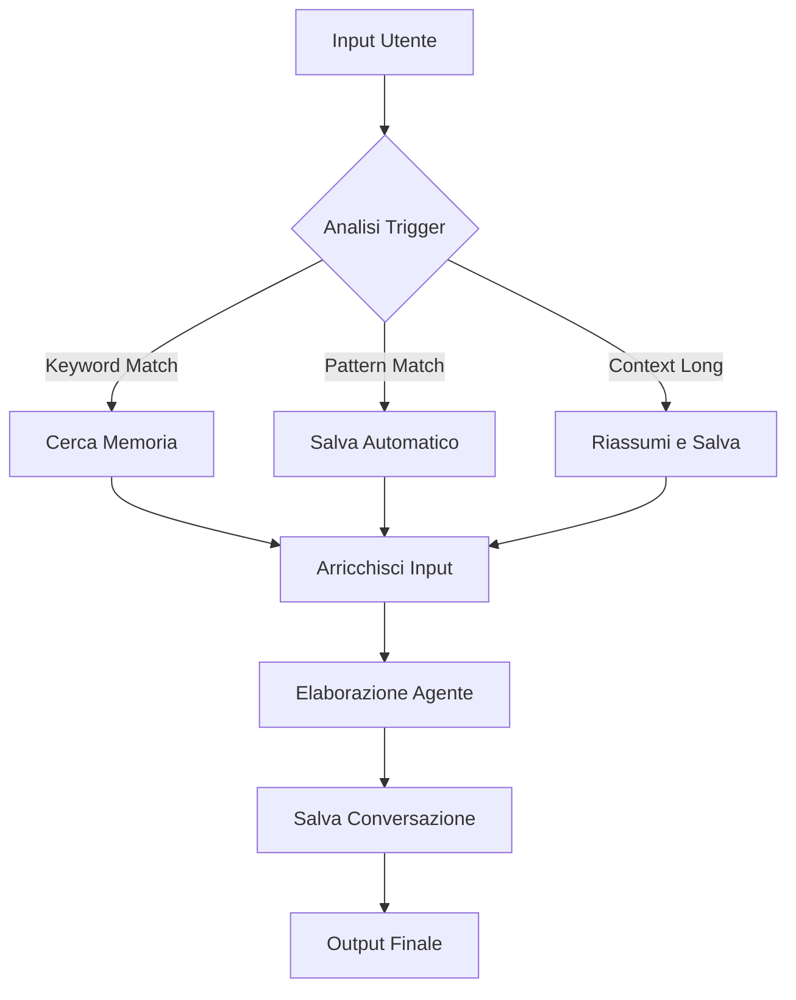

# 🤖 Guida Completa ai Trigger Automatici

## Panoramica

Questa guida spiega come configurare il sistema MCP Memory Server per triggerare **automaticamente** l'uso della memoria da parte degli agenti AI, senza intervento manuale dell'utente.

## 🎯 Tipi di Trigger Automatici

### 1. **Trigger basati su Parole Chiave**
```python
# Parole che attivano il salvataggio automatico
SAVE_KEYWORDS = [
    "ricorda", "salva", "memorizza", "importante", 
    "per dopo", "annota", "tieni presente"
]

# Parole che attivano la ricerca automatica
SEARCH_KEYWORDS = [
    "cosa abbiamo detto", "precedente", "prima", 
    "ricordi", "avevamo parlato", "come dicevamo"
]
```

### 2. **Trigger basati su Pattern**
```python
# Pattern regex per diversi tipi di contenuto
PATTERNS = {
    "domande": r"(come|cosa|quando|dove|perché|quale).{0,50}\?",
    "decisioni": r"(decido|scelgo|opto per|preferisco|raccomando)",
    "codice": r"(function|class|import|def|async|await)",
    "errori": r"(errore|error|exception|failed|problema)"
}
```

### 3. **Trigger Contestuali**
```python
# Trigger basati sul contesto
CONTEXT_TRIGGERS = {
    "lunghezza_testo": 500,      # Caratteri
    "durata_conversazione": 5,   # Messaggi
    "cambio_argomento": 0.3,     # Similarità semantica
    "importanza_alta": 0.8       # Soglia importanza
}
```

## 🔧 Configurazione per Agenti Specifici

### **Claude Desktop**

1. **Configurazione Base** (`claude_desktop_config.json`):
```json
{
  "mcpServers": {
    "memory-server": {
      "command": "python",
      "args": ["/path/to/mcp-memory-server/main.py"],
      "env": {
        "AUTO_TRIGGER": "true",
        "TRIGGER_SENSITIVITY": "medium"
      }
    }
  }
}
```

2. **Trigger Automatici Attivati**:
   - ✅ Salvataggio automatico con parole chiave
   - ✅ Ricerca automatica su riferimenti passati
   - ✅ Estrazione automatica di decisioni
   - ✅ Arricchimento contesto automatico

### **Cursor AI**

1. **Configurazione Plugin** (`cursor_settings.json`):
```json
{
  "mcp.autoTrigger": true,
  "mcp.triggerEvents": {
    "onFileEdit": true,
    "onCodeCompletion": true,
    "onUserQuery": true
  }
}
```

2. **Eventi Automatici**:
   - 📝 Salvataggio snippet di codice utili
   - 🔍 Ricerca pattern simili nel progetto
   - 🚨 Memorizzazione soluzioni errori
   - 💡 Suggerimenti basati su storia

### **Replit Agent**

1. **Configurazione** (`.replit`):
```toml
[deployment]
run = "python main.py"

[env]
AUTO_TRIGGER = "true"
REPLIT_INTEGRATION = "true"
```

2. **Hook Automatici**:
   - 🔄 Auto-save su deploy
   - 📊 Tracking performance miglioramenti
   - 🐛 Memorizzazione debug sessions

## 🚀 Implementazione Automatica

### **1. Wrapper Automatico**

Usa il decoratore per automatizzare qualsiasi agente:

```python
from examples.automatic_triggers import auto_memory_integration

@auto_memory_integration()
async def my_agent(user_input: str) -> str:
    # Il tuo agente esistente
    return process_query(user_input)

# Ora ha memoria automatica!
response = await my_agent("Come posso ottimizzare Python?")
```

### **2. Trigger Personalizzati**

Crea trigger specifici per il tuo dominio:

```python
# Trigger per sviluppo software
SOFTWARE_TRIGGERS = [
    TriggerRule(
        name="bug_tracking",
        trigger_type=TriggerType.PATTERN,
        condition=r"(bug|errore|problema|non funziona)",
        action="save_issue",
        priority=3
    ),
    TriggerRule(
        name="solution_tracking", 
        trigger_type=TriggerType.PATTERN,
        condition=r"(risolto|funziona|sistemato|fix)",
        action="save_solution",
        priority=3
    )
]
```

### **3. Integration Hook**

Per integrazioni esistenti:

```python
class ExistingAgent:
    def __init__(self):
        self.memory_trigger = AutoMemoryTrigger()
    
    async def process_query(self, query: str):
        # Pre-processing automatico
        enhanced_query = await self.memory_trigger.process_input(query)
        
        # Elaborazione normale
        result = self.original_processing(enhanced_query)
        
        # Post-processing automatico
        final_result = await self.memory_trigger.process_output(result, query)
        
        return final_result
```

## ⚡ Trigger in Tempo Reale

### **Eventi che Attivano Automaticamente il Sistema**

1. **Durante la Conversazione**:
   ```
   Utente: "Ricorda che preferiamo PostgreSQL"
   → TRIGGER: save_preference (automatico)
   → Salva: "Preferenza database: PostgreSQL"
   ```

2. **Su Domande di Riferimento**:
   ```
   Utente: "Cosa avevamo deciso per l'architettura?"
   → TRIGGER: search_decision (automatico) 
   → Cerca e presenta decisioni precedenti
   ```

3. **Su Contenuto Tecnico**:
   ```
   Utente: "L'API REST ha questi endpoint..."
   → TRIGGER: save_knowledge (automatico)
   → Salva come conoscenza tecnica
   ```

### **Flusso Automatico Completo**



## 📊 Configurazione Sensibilità

### **Livelli di Trigger**

```python
SENSITIVITY_LEVELS = {
    "low": {
        "keyword_threshold": 1,      # 1 parola chiave
        "pattern_confidence": 0.8,   # Alta confidenza
        "context_min_length": 1000   # Testo lungo
    },
    "medium": {
        "keyword_threshold": 1,
        "pattern_confidence": 0.6,
        "context_min_length": 500
    },
    "high": {
        "keyword_threshold": 1,
        "pattern_confidence": 0.4,
        "context_min_length": 200
    }
}
```

### **Personalizzazione per Dominio**

```python
# Per sviluppo software
DEVELOPMENT_CONFIG = {
    "code_patterns": True,
    "error_tracking": True,
    "solution_memory": True,
    "performance_notes": True
}

# Per business/consulenza  
BUSINESS_CONFIG = {
    "decision_tracking": True,
    "meeting_notes": True,
    "client_preferences": True,
    "strategy_decisions": True
}
```

## 🔍 Monitoraggio Trigger

### **Metriche Automatiche**

Il sistema traccia automaticamente:

- 📈 **Numero trigger attivati per sessione**
- ⏱️ **Tempo di risposta trigger**  
- 🎯 **Precisione trigger (falsi positivi)**
- 💾 **Memoria utilizzata crescente**

### **Dashboard di Trigger**

```python
# Ottieni statistiche trigger
stats = await trigger_system.get_trigger_stats()
print(f"Trigger attivati oggi: {stats['daily_triggers']}")
print(f"Precisione: {stats['accuracy']}%")
print(f"Memorie salvate: {stats['memories_saved']}")
```

## 🛡️ Best Practices

### **1. Evitare Over-Triggering**
```python
# Throttling automatico
THROTTLE_CONFIG = {
    "max_triggers_per_minute": 10,
    "cooldown_between_saves": 30,  # secondi
    "duplicate_detection": True
}
```

### **2. Gestione Privacy**
```python
# Filtri privacy automatici
PRIVACY_FILTERS = {
    "exclude_patterns": [
        r"password\s*[:=]\s*\w+",
        r"api[_-]?key\s*[:=]\s*\w+",
        r"secret\s*[:=]\s*\w+"
    ],
    "anonymize_emails": True,
    "exclude_personal_data": True
}
```

### **3. Ottimizzazione Performance**
```python
# Cache intelligente
PERFORMANCE_CONFIG = {
    "cache_searches": True,
    "batch_saves": True,
    "async_processing": True,
    "lazy_loading": True
}
```

## 🎯 Esempi Pratici

### **Scenario 1: Sviluppatore**
```bash
# L'agente automaticamente:
1. Salva snippet di codice utili
2. Ricorda preferenze architetturali  
3. Traccia soluzioni a bug
4. Mantiene context del progetto
```

### **Scenario 2: Consulente Business**
```bash
# L'agente automaticamente:
1. Memorizza decisioni client
2. Traccia preferenze stakeholder
3. Salva insight di mercato
4. Mantiene storia progetti
```

### **Scenario 3: Ricercatore**
```bash
# L'agente automaticamente:
1. Organizza scoperte ricerca
2. Collega concetti correlati
3. Traccia evoluzione idee
4. Mantiene bibliografia intelligente
```

## 🔄 Aggiornamento Trigger

Il sistema si auto-migliora attraverso:

1. **Apprendimento Pattern**: Identifica nuovi pattern utili
2. **Feedback Implicito**: Usa interazioni per migliorare precisione  
3. **Adattamento Contesto**: Si adatta al dominio d'uso
4. **Ottimizzazione Automatica**: Regola soglie per performance ottimali

---

**Con questi trigger automatici, gli agenti AI diventano veramente intelligenti, ricordando e imparando da ogni interazione senza bisogno di comando esplicito!** 🧠✨ 