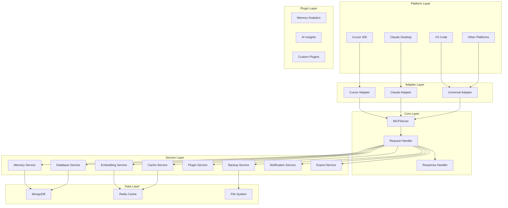
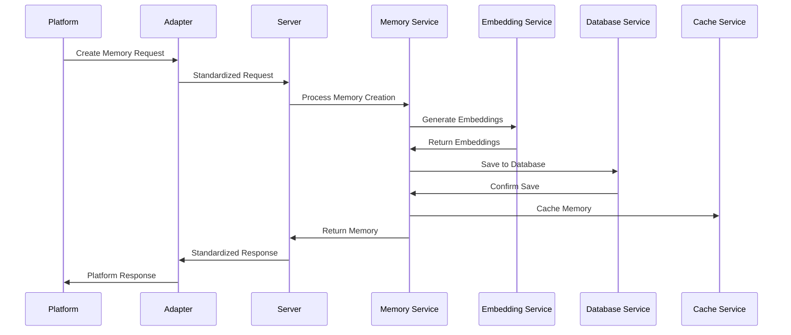
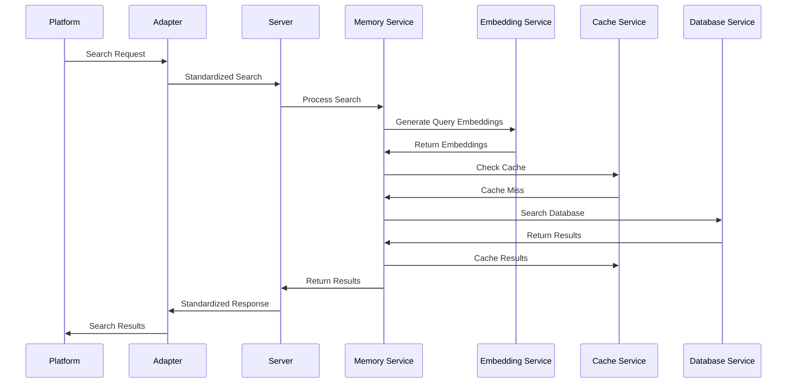

# 🏗️ **Architecture Overview - MCP Memory Server**

## 📖 **Introduction**

The MCP Memory Server is built with a modular, scalable, and extensible architecture that follows **Separation of Concerns**, **Dependency Injection**, and **Plugin Architecture** principles.

## 🎯 **Design Principles**

### **1. Modularity**
- **Independent Services**: Each functionality is a separate service
- **Low Coupling**: Services communicate through well-defined interfaces
- **High Cohesion**: Each module has specific and well-defined responsibilities

### **2. Extensibility**
- **Plugin System**: Functionality can be extended via plugins
- **Platform Adapters**: Support for multiple platforms through adapters
- **Hooks System**: Extension points in critical operations

### **3. Performance**
- **Distributed Cache**: Local and Redis cache for optimization
- **Asynchronous Processing**: Non-blocking operations
- **Embedding Optimization**: Cache and batch processing

### **4. Robustness**
- **Error Handling**: Robust exception handling system
- **Health Checks**: Continuous service health monitoring
- **Automatic Backup**: Data protection with backup and restoration

## 🏗️ **High-Level Architecture**



## 🏛️ **Architecture Layers**

### **1. Platform Layer**
The top layer consists of various AI platforms and IDEs that integrate with the MCP Memory Server:
- **Cursor IDE**: Primary development environment
- **Claude Desktop**: Anthropic's desktop application
- **VS Code**: Microsoft's code editor
- **Other Platforms**: Any platform supporting MCP protocol

### **2. Adapter Layer**
Platform-specific adapters that translate platform-specific requests into standardized MCP operations:
- **Cursor Adapter**: Handles Cursor IDE specific features
- **Claude Adapter**: Manages Claude Desktop integration
- **Universal Adapter**: Generic adapter for other platforms

### **3. Core Layer**
The central MCP server that orchestrates all operations:
- **MCPServer**: Main server implementation
- **Request Handler**: Processes incoming requests
- **Response Handler**: Formats and returns responses

### **4. Service Layer**
Business logic services that handle specific functionality:
- **Memory Service**: Core memory management
- **Database Service**: Data persistence operations
- **Embedding Service**: Text embedding generation
- **Cache Service**: Performance optimization
- **Plugin Service**: Plugin system management
- **Backup Service**: Data backup and restore
- **Notification Service**: Multi-channel notifications
- **Export Service**: Data export functionality

### **5. Data Layer**
Data storage and caching systems:
- **MongoDB**: Primary database for memories
- **Redis Cache**: Distributed caching
- **File System**: Local file storage

### **6. Plugin Layer**
Extensible functionality through plugins:
- **Memory Analytics**: Advanced memory analysis
- **AI Insights**: AI-powered insights
- **Custom Plugins**: User-defined extensions

## 🔄 **Data Flow**

### **1. Memory Creation Flow**


### **2. Memory Search Flow**


## 🔧 **Service Architecture**

### **1. Memory Service**
The core service responsible for memory operations:

```python
class MemoryService:
    """Core memory management service."""
    
    def __init__(self, settings: Settings):
        self.database_service = DatabaseService(settings.database)
        self.embedding_service = EmbeddingService(settings.embedding)
        self.cache_service = CacheService(settings.cache)
        self.plugin_service = PluginService(settings.plugins)
    
    async def create_memory(self, content: str, project: str) -> Memory:
        """Create a new memory."""
        # Generate embeddings
        embeddings = await self.embedding_service.generate_embeddings(content)
        
        # Create memory object
        memory = Memory(content=content, project=project, embeddings=embeddings)
        
        # Save to database
        saved_memory = await self.database_service.save_memory(memory)
        
        # Cache memory
        await self.cache_service.cache_memory(saved_memory)
        
        # Trigger plugins
        await self.plugin_service.call_hook("memory_created", saved_memory)
        
        return saved_memory
```

### **2. Database Service**
Handles all database operations:

```python
class DatabaseService:
    """Database operations service."""
    
    def __init__(self, config: DatabaseConfig):
        self.client = AsyncIOMotorClient(config.mongodb.uri)
        self.database = self.client[config.mongodb.database]
        self.collection = self.database[config.mongodb.collection]
    
    async def save_memory(self, memory: Memory) -> Memory:
        """Save memory to database."""
        memory_dict = memory.dict()
        result = await self.collection.insert_one(memory_dict)
        memory.id = str(result.inserted_id)
        return memory
    
    async def search_memories(self, query_embeddings: List[float], limit: int = 10) -> List[Memory]:
        """Search memories by embeddings."""
        pipeline = [
            {
                "$vectorSearch": {
                    "queryVector": query_embeddings,
                    "path": "embeddings",
                    "numCandidates": limit * 10,
                    "limit": limit,
                    "index": "vector_index"
                }
            }
        ]
        
        cursor = self.collection.aggregate(pipeline)
        results = await cursor.to_list(length=limit)
        return [Memory(**result) for result in results]
```

### **3. Embedding Service**
Manages text embedding generation:

```python
class EmbeddingService:
    """Text embedding generation service."""
    
    def __init__(self, config: EmbeddingConfig):
        self.model = SentenceTransformer(config.model)
        self.cache_enabled = config.cache_enabled
        self.cache_service = CacheService(config)
    
    async def generate_embeddings(self, text: str) -> List[float]:
        """Generate embeddings for text."""
        # Check cache first
        if self.cache_enabled:
            cached = await self.cache_service.get(f"embedding:{hash(text)}")
            if cached:
                return cached
        
        # Generate embeddings
        embeddings = self.model.encode(text).tolist()
        
        # Cache embeddings
        if self.cache_enabled:
            await self.cache_service.set(f"embedding:{hash(text)}", embeddings)
        
        return embeddings
```

## 🔌 **Plugin System**

### **1. Plugin Architecture**
The plugin system allows extending functionality without modifying core code:

```python
class PluginService:
    """Plugin management service."""
    
    def __init__(self, config: PluginConfig):
        self.plugins = {}
        self.hooks = defaultdict(list)
        self.config = config
    
    async def load_plugins(self):
        """Load all configured plugins."""
        for plugin_name in self.config.plugins:
            plugin = await self._load_plugin(plugin_name)
            if plugin:
                self.plugins[plugin_name] = plugin
                await self._register_hooks(plugin)
    
    async def call_hook(self, hook_name: str, *args, **kwargs):
        """Call all registered hooks for an event."""
        for hook_func in self.hooks[hook_name]:
            try:
                await hook_func(*args, **kwargs)
            except Exception as e:
                logger.error(f"Plugin hook error: {e}")
```

### **2. Plugin Example**
Example of a custom plugin:

```python
# plugins/memory_analytics/plugin.py
PLUGIN_INFO = {
    "name": "Memory Analytics",
    "version": "1.0.0",
    "description": "Advanced memory analytics",
    "hooks": ["memory_created", "search_performed"]
}

async def memory_created(memory, context):
    """Analyze memory when created."""
    # Perform analytics
    analytics = await analyze_memory(memory)
    
    # Store analytics
    await store_analytics(analytics)

async def search_performed(query, results, context):
    """Track search patterns."""
    # Log search metrics
    await log_search_metrics(query, len(results))
```

## 📊 **Performance Architecture**

### **1. Caching Strategy**
Multi-level caching for optimal performance:

```python
class CacheService:
    """Multi-level caching service."""
    
    def __init__(self, config: CacheConfig):
        self.local_cache = {}
        self.redis_client = redis.Redis(**config.redis) if config.type == "redis" else None
        self.ttl = config.ttl
    
    async def get(self, key: str):
        """Get value from cache."""
        # Try local cache first
        if key in self.local_cache:
            return self.local_cache[key]
        
        # Try Redis cache
        if self.redis_client:
            value = await self.redis_client.get(key)
            if value:
                # Cache in local cache
                self.local_cache[key] = value
                return value
        
        return None
    
    async def set(self, key: str, value, ttl: int = None):
        """Set value in cache."""
        # Set in local cache
        self.local_cache[key] = value
        
        # Set in Redis cache
        if self.redis_client:
            await self.redis_client.setex(key, ttl or self.ttl, value)
```

### **2. Async Processing**
All operations are asynchronous for better performance:

```python
class AsyncMemoryProcessor:
    """Asynchronous memory processing."""
    
    async def process_memories_batch(self, memories: List[Memory]):
        """Process multiple memories concurrently."""
        tasks = [
            self.process_single_memory(memory)
            for memory in memories
        ]
        
        results = await asyncio.gather(*tasks, return_exceptions=True)
        return [r for r in results if not isinstance(r, Exception)]
    
    async def process_single_memory(self, memory: Memory):
        """Process a single memory."""
        # Generate embeddings
        embeddings = await self.embedding_service.generate_embeddings(memory.content)
        
        # Update memory
        memory.embeddings = embeddings
        
        # Save to database
        await self.database_service.save_memory(memory)
        
        return memory
```

## 🔒 **Security Architecture**

### **1. Authentication & Authorization**
Multi-level security system:

```python
class SecurityService:
    """Security management service."""
    
    def __init__(self, config: SecurityConfig):
        self.jwt_secret = config.jwt_secret
        self.rate_limiter = RateLimiter(config.rate_limit)
    
    async def authenticate_request(self, request):
        """Authenticate incoming request."""
        token = request.headers.get("Authorization")
        if not token:
            raise AuthenticationError("No token provided")
        
        try:
            payload = jwt.decode(token, self.jwt_secret, algorithms=["HS256"])
            return payload
        except jwt.InvalidTokenError:
            raise AuthenticationError("Invalid token")
    
    async def authorize_operation(self, user, operation):
        """Authorize user for operation."""
        if not user.has_permission(operation):
            raise AuthorizationError("Insufficient permissions")
```

### **2. Data Encryption**
End-to-end encryption for sensitive data:

```python
class EncryptionService:
    """Data encryption service."""
    
    def __init__(self, config: EncryptionConfig):
        self.key = config.encryption_key
        self.cipher = AES.new(self.key, AES.MODE_GCM)
    
    def encrypt_data(self, data: str) -> bytes:
        """Encrypt sensitive data."""
        ciphertext, tag = self.cipher.encrypt_and_digest(data.encode())
        return ciphertext + tag
    
    def decrypt_data(self, encrypted_data: bytes) -> str:
        """Decrypt sensitive data."""
        ciphertext = encrypted_data[:-16]
        tag = encrypted_data[-16:]
        plaintext = self.cipher.decrypt_and_verify(ciphertext, tag)
        return plaintext.decode()
```

## 📈 **Scalability Architecture**

### **1. Horizontal Scaling**
Support for multiple server instances:

```python
class LoadBalancer:
    """Load balancing for multiple instances."""
    
    def __init__(self, config: LoadBalancerConfig):
        self.instances = config.instances
        self.current_index = 0
    
    def get_next_instance(self) -> str:
        """Get next available instance."""
        instance = self.instances[self.current_index]
        self.current_index = (self.current_index + 1) % len(self.instances)
        return instance
```

### **2. Database Sharding**
Support for database sharding:

```python
class ShardedDatabaseService:
    """Sharded database service."""
    
    def __init__(self, config: ShardingConfig):
        self.shards = config.shards
        self.shard_key = config.shard_key
    
    def get_shard(self, key: str) -> DatabaseService:
        """Get appropriate shard for key."""
        shard_index = hash(key) % len(self.shards)
        return self.shards[shard_index]
    
    async def save_memory(self, memory: Memory) -> Memory:
        """Save memory to appropriate shard."""
        shard = self.get_shard(memory.project)
        return await shard.save_memory(memory)
```

## 🔍 **Monitoring Architecture**

### **1. Health Checks**
Comprehensive health monitoring:

```python
class HealthCheckService:
    """Health monitoring service."""
    
    async def check_all_services(self) -> Dict[str, Any]:
        """Check health of all services."""
        checks = {
            "database": await self.check_database(),
            "cache": await self.check_cache(),
            "embedding": await self.check_embedding_service(),
            "plugins": await self.check_plugins()
        }
        
        overall_status = "healthy" if all(
            check["status"] == "healthy" for check in checks.values()
        ) else "unhealthy"
        
        return {
            "status": overall_status,
            "checks": checks,
            "timestamp": datetime.utcnow().isoformat()
        }
```

### **2. Metrics Collection**
Performance metrics collection:

```python
class MetricsService:
    """Metrics collection service."""
    
    def __init__(self):
        self.metrics = defaultdict(int)
        self.timers = defaultdict(list)
    
    def record_request(self, service: str, success: bool, duration: float):
        """Record service request metrics."""
        self.metrics[f"{service}_requests"] += 1
        if success:
            self.metrics[f"{service}_success"] += 1
        else:
            self.metrics[f"{service}_errors"] += 1
        
        self.timers[f"{service}_duration"].append(duration)
    
    def get_metrics(self) -> Dict[str, Any]:
        """Get current metrics."""
        return {
            "counters": dict(self.metrics),
            "averages": {
                service: sum(times) / len(times) if times else 0
                for service, times in self.timers.items()
            }
        }
```

## 🚀 **Deployment Architecture**

### **1. Containerization**
Docker-based deployment:

```dockerfile
# Dockerfile
FROM python:3.11-slim

WORKDIR /app

COPY requirements.txt .
RUN pip install -r requirements.txt

COPY . .

EXPOSE 8000

CMD ["python", "main.py"]
```

### **2. Kubernetes Deployment**
Kubernetes orchestration:

```yaml
# deployment.yaml
apiVersion: apps/v1
kind: Deployment
metadata:
  name: mcp-memory-server
spec:
  replicas: 3
  selector:
    matchLabels:
      app: mcp-memory-server
  template:
    metadata:
      labels:
        app: mcp-memory-server
    spec:
      containers:
      - name: mcp-memory-server
        image: mcp-memory-server:latest
        ports:
        - containerPort: 8000
        env:
        - name: ENVIRONMENT
          value: "production"
```

## 📚 **Architecture Benefits**

### **1. Maintainability**
- **Modular Design**: Easy to understand and modify
- **Clear Separation**: Each component has a specific responsibility
- **Well-Defined Interfaces**: Clear contracts between components

### **2. Scalability**
- **Horizontal Scaling**: Support for multiple instances
- **Database Sharding**: Distributed data storage
- **Caching**: Performance optimization at multiple levels

### **3. Extensibility**
- **Plugin System**: Easy to add new functionality
- **Adapter Pattern**: Support for new platforms
- **Hook System**: Extension points throughout the system

### **4. Reliability**
- **Error Handling**: Comprehensive error management
- **Health Monitoring**: Continuous system health checks
- **Backup System**: Data protection and recovery

---

**For detailed implementation, see the [Service Documentation](docs/services/)** 