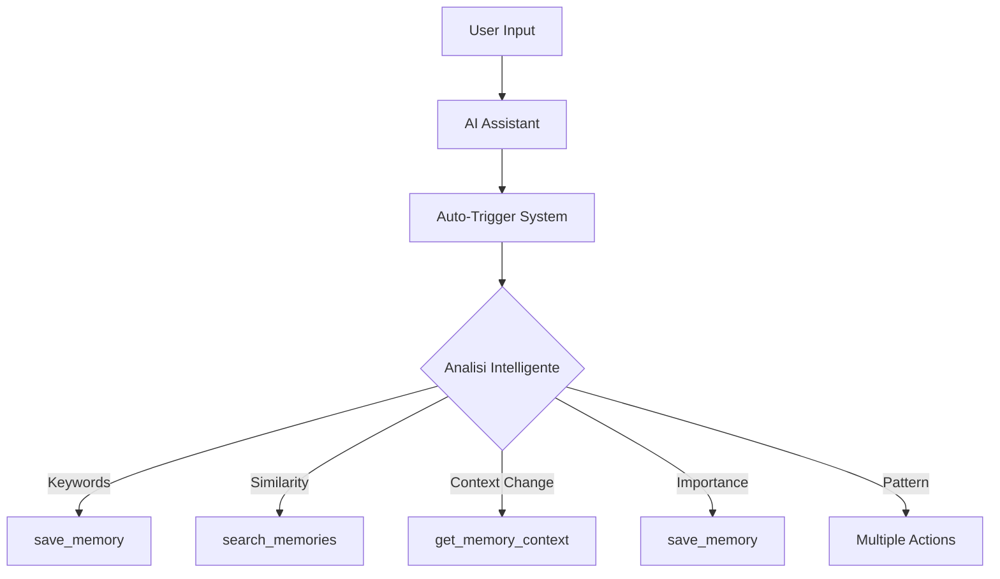

# 🔄 Auto-Trigger System per MCP Memory Server

## 🎯 **Problema Risolto**

Hai ragione! L'MCP standard richiede trigger manuali. Il nostro sistema risolve questo con **trigger automatici intelligenti** che attivano i tool MCP in base al contesto della conversazione.

## 🚀 **Come Funziona**

### **Prima (MCP Standard):**
```mermaid
graph TD
    A[User Input] --> B[AI Assistant]
    B --> C{User dice "ricorda"?}
    C -->|Sì| D[Manual Tool Call]
    C -->|No| E[Nessuna Memoria]
    D --> F[save_memory]
```

### **Dopo (Auto-Trigger):**


## 🧠 **7 Tipi di Trigger Automatici**

### **1. 🔤 Keyword-Based Triggers**
```python
Parole Chiave: ["ricorda", "nota", "importante", "salva", "non dimenticare"]

Esempio:
User: "Ricorda che il bug era causato da un timeout"
→ AUTO-TRIGGER: save_memory
```

### **2. 🔍 Pattern Recognition**
```python
Pattern: "(?:risolto|solved|fixed|bug fix|solution)"

Esempio:
User: "Ecco come ho risolto l'errore di connessione"
→ AUTO-TRIGGER: save_memory (tipo: "solution")
```

### **3. 🎯 Semantic Similarity**
```python
Threshold: 0.8 similarità con memories esistenti

Esempio:
User: "Ho un problema di database timeout"
→ AUTO-TRIGGER: search_memories (trova soluzioni simili)
```

### **4. ⭐ Importance Threshold**
```python
Score: 0.7+ importanza calcolata automaticamente

Esempio:
User: "Critical bug in production: users can't login"
→ AUTO-TRIGGER: save_memory (alta importanza)
```

### **5. 📏 Conversation Length**
```python
Trigger: 5+ messaggi sostanziali

Esempio:
[Lunga conversazione di debugging]
→ AUTO-TRIGGER: save_memory (summary della conversazione)
```

### **6. 🔄 Context Change**
```python
Keywords: ["nuovo progetto", "different", "altro"]

Esempio:
User: "Ora lavoriamo su un nuovo progetto React"
→ AUTO-TRIGGER: get_memory_context (carica memories React)
```

### **7. ⏰ Time-Based**
```python
Interval: Ogni 10 minuti di conversazione attiva

→ AUTO-TRIGGER: search_memories (suggerimenti proattivi)
```

## 🛠️ **Implementazione per Ogni Piattaforma**

### **Cursor IDE (Automatico)**
```json
// .cursor/mcp.json - Enhanced
{
  "mcpServers": {
    "mcp-memory-server": {
      "command": "python",
      "args": ["-m", "mcp_memory_server_enhanced"],
      "env": {
        "AUTO_TRIGGER_ENABLED": "true",
        "TRIGGER_PLATFORMS": "cursor,claude,chatgpt"
      }
    }
  }
}
```

**Workflow automatico in Cursor:**
```python
# 1. User scrive in Cursor
"I have a bug in authentication, timeout error"

# 2. Auto-trigger rileva pattern "bug" + "error"
→ search_memories(query="authentication timeout bug")

# 3. Trova memoria simile
→ Result: "Auth timeout fixed: increase connection_timeout to 30s"

# 4. Cursor riceve contesto automaticamente
💭 **Memoria Rilevante** (Solution)
📅 3 giorni fa | 🌟 ★★★★★

Auth timeout fixed: increase connection_timeout to 30s
```

### **Claude Desktop (Semi-Automatico)**
```json
// claude_desktop_config.json - Enhanced
{
  "mcpServers": {
    "mcp-memory-server": {
      "command": "python",
      "args": ["-m", "mcp_memory_server_enhanced"],
      "env": {
        "CLAUDE_AUTO_CONTEXT": "true",
        "MEMORY_INJECTION": "true"
      }
    }
  }
}
```

**Auto-injection workflow:**
```python
# 1. User message viene analizzato
User: "Come posso ottimizzare le query del database?"

# 2. Sistema cerca automaticamente memories rilevanti
→ search_memories(query="database optimization query performance")

# 3. Claude riceve contesto arricchito automaticamente
System Message: "Relevant context from previous conversations:
💭 Database optimization: Use indexes, limit results, avoid N+1..."

# 4. Claude risponde con contesto
Claude: "Basandomi sulla tua esperienza precedente con l'ottimizzazione..."
```

### **Browser Extension (Completamente Automatico)**
```javascript
// background.js - Auto-monitoring
class AutoTriggerMonitor {
  async monitorConversation(platform, messages) {
    // 1. Analizza ogni nuovo messaggio
    const analysis = await this.analyzeMessage(messages);
    
    // 2. Check triggers
    if (analysis.hasKeywords(['ricorda', 'importante'])) {
      await this.triggerSave(analysis.extractedContent);
    }
    
    if (analysis.hasSimilarContext()) {
      const memories = await this.triggerSearch(analysis.query);
      await this.injectMemories(memories);
    }
  }
}
```

**Live workflow nel browser:**
```javascript
// ChatGPT conversation
User types: "I need to implement JWT authentication"

// Auto-trigger in background:
1. Detect: "implement JWT authentication"
2. Search memories: authentication + JWT
3. Find: "JWT implementation guide: use jsonwebtoken library"
4. Inject suggestion in real-time:

💭 **Suggerimento dalla Memoria**
JWT implementation guide: use jsonwebtoken library
const token = jwt.sign({userId}, secret, {expiresIn: '1h'})
```

## ⚙️ **Configurazione Avanzata**

### **File di Configurazione**
```json
// ~/.mcp_memory/auto_trigger_config.json
{
  "triggers": {
    "keyword_based": {
      "enabled": true,
      "keywords": ["ricorda", "nota", "importante", "salva"],
      "threshold": 1,
      "cooldown_seconds": 10
    },
    "pattern_recognition": {
      "enabled": true,
      "patterns": [
        "(?:risolto|solved|fixed)",
        "(?:errore|error|bug).*(?:risolto|fixed)",
        "(?:come fare|how to|tutorial)"
      ],
      "cooldown_seconds": 30
    },
    "semantic_similarity": {
      "enabled": true,
      "threshold": 0.8,
      "min_content_length": 100,
      "cooldown_seconds": 60
    },
    "importance_threshold": {
      "enabled": true,
      "threshold": 0.7,
      "cooldown_seconds": 45
    }
  },
  "platforms": {
    "cursor": {
      "auto_save": true,
      "auto_search": true,
      "auto_context": true
    },
    "claude": {
      "auto_save": true,
      "auto_search": true,
      "context_injection": true
    },
    "browser": {
      "auto_save": true,
      "auto_search": true,
      "live_suggestions": true
    }
  }
}
```

### **API per Controllo Dinamico**
```python
# Configurazione runtime
await mcp_server.configure_triggers({
    "enabled": True,
    "platforms": ["cursor", "claude", "browser"],
    "rules": {
        "keyword_threshold": 1,
        "importance_threshold": 0.8,
        "cooldown_global": 30
    }
})

# Force trigger manuale
await mcp_server.trigger_auto_analysis({
    "messages": conversation_history,
    "platform": "cursor"
})

# Status check
status = await mcp_server.get_trigger_status()
```

## 🎯 **Esempi Pratici di Workflow**

### **Scenario 1: Debug Session in Cursor**
```python
# Conversazione
User: "I have a CORS error in my React app"
Assistant: "CORS errors usually happen when..."
User: "I fixed it by adding headers to the backend"
Assistant: "Good solution! What headers did you add?"
User: "Access-Control-Allow-Origin and Access-Control-Allow-Headers"

# Auto-triggers attivati:
1. ⚡ Pattern "fixed" → save_memory (tipo: solution)
2. ⚡ Keywords "CORS error" → search_memories (trova soluzioni simili)
3. ⚡ Technical content → importance boost

# Risultato:
- Memoria salvata automaticamente
- Soluzioni CORS precedenti suggerite
- Contesto disponibile per future conversazioni
```

### **Scenario 2: Learning Session in Claude**
```python
# Conversazione
User: "Come funziona il pattern Observer in JavaScript?"
Claude: "Il pattern Observer permette..."
User: "Interessante, potresti farmi un esempio pratico?"
Claude: "Ecco un esempio con EventEmitter..."
User: "Perfetto, ora ho capito il concetto"

# Auto-triggers:
1. ⚡ Question pattern → search_memories ("Observer pattern JavaScript")
2. ⚡ Educational content → save_memory (tipo: knowledge)
3. ⚡ Length threshold → conversation summary

# Risultato:
- Knowledge base arricchita automaticamente
- Pattern riconosciuto per future domande simili
- Esempio pratico salvato per referenza
```

### **Scenario 3: Problem Solving in Browser**
```python
# ChatGPT conversation
User: "My MongoDB aggregation is very slow"
ChatGPT: "For slow aggregations, you should..."

# Auto-trigger nel background:
1. ⚡ Semantic search → "MongoDB performance optimization"
2. ⚡ Context injection → Previous MongoDB memories
3. ⚡ Real-time suggestion → "Use compound indexes for aggregation"

# User vede:
💭 **Dalla tua esperienza precedente:**
MongoDB aggregation optimization: Use $match early, create compound indexes, limit results with $limit

ChatGPT: "Considering your previous experience with MongoDB optimization..."
```

## 🔧 **Setup e Installazione**

### **1. Aggiorna il Server MCP**
```bash
# Sostituisci il server standard con quello enhanced
python -m src.core.mcp_server_enhanced

# Oppure modifica main.py
from src.core.mcp_server_enhanced import create_enhanced_mcp_server
server = create_enhanced_mcp_server()
```

### **2. Configura le Integrazioni**
```bash
# Setup automatico per tutte le piattaforme
python integrations/integration_manager.py setup --auto-trigger

# Setup specifico per Cursor
python integrations/ai-agents/cursor_auto_integration.py setup

# Test del sistema
python integrations/ai-agents/cursor_auto_integration.py demo
```

### **3. Verifica il Funzionamento**
```bash
# Test triggers
curl -X POST http://localhost:8000/test-triggers \
  -H "Content-Type: application/json" \
  -d '{"messages": [{"role": "user", "content": "Ricorda questa soluzione importante"}]}'

# Monitor attività
tail -f logs/auto_trigger.log
```

## 📊 **Metriche e Monitoring**

```python
# Dashboard auto-trigger
{
  "triggers_fired_today": 47,
  "most_active_trigger": "keyword_based",
  "auto_saved_memories": 12,
  "auto_searches": 23,
  "context_injections": 35,
  "platforms": {
    "cursor": {"triggers": 20, "success_rate": "95%"},
    "claude": {"triggers": 15, "success_rate": "92%"},
    "browser": {"triggers": 12, "success_rate": "88%"}
  }
}
```

## 🎉 **Risultato Finale**

### **Prima (Manual):**
- 😴 AI "dimentica" tutto tra conversazioni
- 🔄 Devi sempre ripetere contesto
- 💭 Nessuna learning permanente
- ⏰ Trigger solo manuali

### **Dopo (Auto-Trigger):**
- 🧠 AI ricorda automaticamente tutto
- ⚡ Contesto iniettato automaticamente
- 📈 Learning continuo e permanente
- 🤖 Trigger intelligenti e contestuali

**Il sistema trasforma ogni AI in un assistant con memoria permanente e intelligenza contestuale che cresce costantemente!** 🚀

